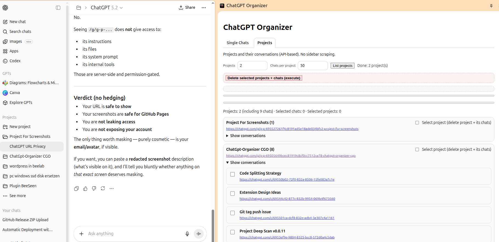

<a href="https://nathabee.github.io/chatgpt-organizer/index.html">
   
</a>

# ChatGPT Organizer (CGO)   

**ChatGPT Organizer** is a browser extension that helps you inspect and clean up your ChatGPT conversations.

The first goal is pragmatic:  
**list and bulk-delete conversations safely**, without manually clicking hundreds of chats in the sidebar.

The project is intentionally simple, local-first, and transparent.

---

## What this extension does

- Runs entirely in your browser
- Acts only on your own ChatGPT account
- Requires you to be logged in to chatgpt.com
- Does not store credentials
- Does not access other users' data

---
## ChatGPT Organizer – UI


 
---

## Responsibility

This tool automates actions that are normally performed manually
by the user in the ChatGPT interface. Use at your own discretion.

---

## Why this exists

Long ChatGPT histories slow down browsers and make the UI painful to use.  
ChatGPT currently offers:
- delete one conversation at a time, or
- delete everything

What’s missing is controlled, selective cleanup.

ChatGPT Organizer aims to fill that gap.

---

## Features (current)

- Chrome MV3 extension
- Side panel UI
- Quick scan: lists conversations visible in the current ChatGPT UI
- Deep scan (auto-scroll): collects more conversations by scrolling the UI
- Checkbox selection with live counters
- Safe bulk delete:
  - inline confirmation (count + preview + checkbox)
  - throttled execution
  - progress indicator and per-item log
  - removed items disappear from the list as they are deleted

Notes:
- The extension lists what ChatGPT loads in the UI. For very large histories, scanning everything depends on how ChatGPT loads older items.

---

## Planned features

- Better large-history handling:
  - improved deep scan strategies
  - optional chunked deletion (run in batches)
- Keyword filtering (titles)
- Lightweight grouping and saved “project” lists (local-only)
- Basic stats based on local scanning history (first seen / last seen), not on true creation dates

---

## Project principles

- No server
- No tracking
- No analytics
- Runs only in your browser
- Uses your existing ChatGPT login session
- Clear, auditable source code

---

## Tech stack

- Chrome Extension (Manifest V3)
- TypeScript
- esbuild
- No framework (plain DOM)

---

## Development

```bash
npm install
npm run build
````

---

## Installation

Load the extension from the generated dist/ directory via:

```bash
chrome://extensions → Load unpacked
```

Detailed installation (Chrome/Chromium):

* Open chrome://extensions
* Enable “Developer mode”
* Click “Load unpacked”
* Select this folder: chatgpt-organizer/ (the project root)

The extension should appear. Open ChatGPT, then open the side panel.

Notes:

This is a client-side tool. It does not require your ChatGPT password. It relies on the fact that you are already logged into chatgpt.com in your browser.

---

## Status

Early development. APIs and UI may change as ChatGPT evolves.

---

## For more information

Visit the github pages: <a href="https://nathabee.github.io/chatgpt-organizer/index.html">  </a>

---

## License

MIT — see LICENSE
