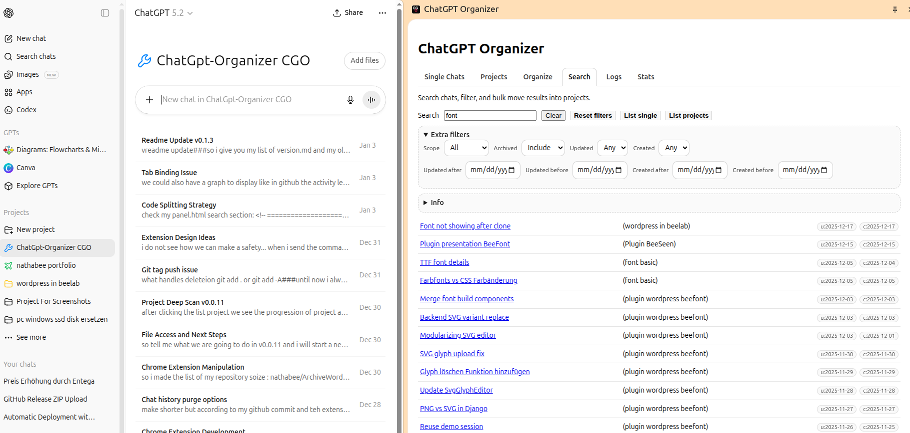
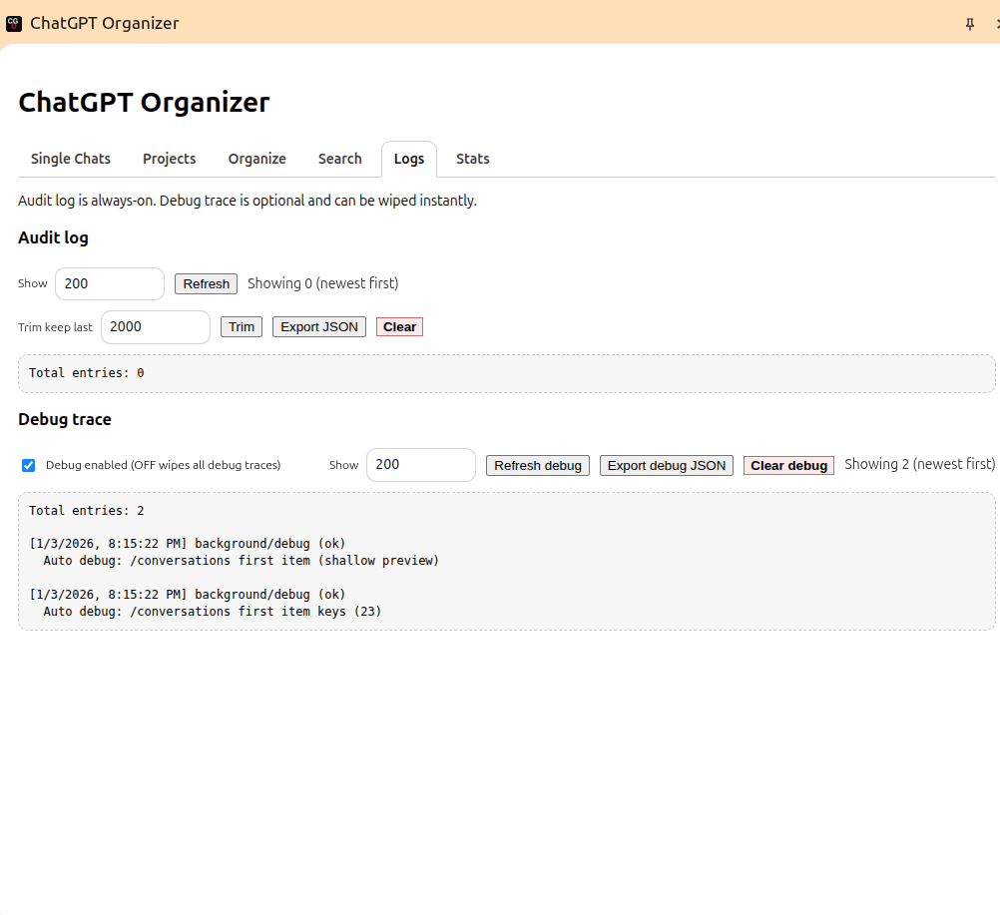

<a href="https://nathabee.github.io/chatgpt-organizer/index.html">
   
</a>

# ChatGPT Organizer (CGO)

 

**ChatGPT Organizer** is a browser extension that gives you **visibility and control** over your own ChatGPT conversations.

It started as a cleanup tool.
As of **v0.1.x**, it is evolving into a **long-term organization and inspection tool**.

The philosophy is simple:

> **Show what exists. Let the user decide. Execute explicitly.**

No server. No sync. No automation behind your back.

---

## What this extension does (and does not)

**Does**

* Runs entirely in your browser
* Uses your existing ChatGPT login session
* Lists chats and projects via the same backend APIs the UI uses
* Executes actions only when you explicitly click
* Keeps a local, auditable action log

**Does NOT**

* Store credentials
* Sync data anywhere
* Access other accounts
* Modify chats automatically
* Pretend deletions are reversible

---

## UI Overview

**Search screen**


**Projects screen**


**Logs screen**


The side panel is organized into **explicit tabs**, each with a single responsibility.

### Tabs at a glance

| Tab          | Status        | Purpose                                                           |
| ------------ | ------------- | ----------------------------------------------------------------- |
| **Single**   | ✅ Active      | List and delete standalone (non-project) chats                    |
| **Projects** | ✅ Active      | Browse projects and their conversations, delete chats or projects |
| **Search**   | ✅ Active      | Search across *loaded* chats (singles + projects)                 |
| **Logs**     | ✅ Active      | Audit log + debug trace                                           |
| **Organize** | ⏳ Placeholder | Future: move chats into projects                                  |
| **Stats**    | ⏳ Placeholder | Future: read-only overview                                        |

---

## Core features (current)

### Single chats

* List standalone chats via backend API
* Supports pagination and limits
* Checkbox selection with live counters
* Bulk delete with:

  * explicit confirmation
  * throttling
  * progress feedback
  * per-item results

### Projects

* List all projects
* Expand projects to see conversations
* Select:

  * individual conversations
  * entire projects
* Delete flow:

  1. conversations are deleted first
  2. project is deleted afterwards
* Separate progress for chats vs projects

### Search

Search is **cache-driven**, not magic.

* Searches only what is currently loaded from:

  * **Single → List**
  * **Projects → List**
* Live updates when cache changes
* Matches against:

  * title
  * snippet (if present)
  * conversation id
  * project title (for project chats)

Clear empty state:

> “No data loaded yet. Use Single/Projects and click List.”

Filters exist only where the data is reliable.

### Logs

There are **two different logs**, on purpose:

#### Audit Log

* Append-only by default
* Records:

  * deletions
  * project removals
  * bulk actions
* Stored locally
* User can:

  * limit view
  * trim
  * export JSON
  * clear manually

#### Debug Trace

* Developer-oriented
* Explicit ON/OFF toggle
* OFF = wiped immediately
* Captures small API shape samples (never full payloads)

No fake “undo”.
Only traceability.

---

## Safety & responsibility

This extension automates actions that **you could perform manually** in the ChatGPT UI.

* Deletions are real
* There is no server-side undo
* The tool provides **confirmation and traceability**, not artificial safety

If you do not understand what a button does, **do not click it**.

---

## Why this exists

ChatGPT currently offers:

* delete one chat at a time, or
* delete everything

That is not sufficient once you have **hundreds or thousands of chats**.

ChatGPT Organizer exists to fill that gap with:

* inspection
* selection
* controlled execution

Nothing more. Nothing hidden.

---

## Project principles

* No backend
* No tracking
* No analytics
* Local-only storage
* Explicit user actions
* Auditable behavior
* Source code over promises

---

## Tech stack

* Chrome Extension (Manifest V3)
* TypeScript
* esbuild
* Plain DOM (no framework)

---
You’re right — the README must **explicitly say that non-developers can install it**, and that the **GitHub Release ZIP is the primary path**.
What you pasted still reads like “dev-only”.

Here is a **clean replacement** for the **Development + Installation** sections.
You can paste this verbatim.

---

## Installation from GitHub Release (ZIP) 

You **do not need to be a developer** to install ChatGPT Organizer.


1. Go to the **GitHub Releases** page
   (latest version is listed at the top)
2. Download the provided **ZIP archive**
3. Extract the ZIP somewhere on your computer
4. Open Chrome and go to:

   ```
   chrome://extensions
   ```
5. Enable **Developer mode**
6. Click **Load unpacked**
7. Select the **extracted folder** (the one containing `manifest.json`)

Open ChatGPT → open the side panel.

This is the **intended installation path** for normal users.

---

 

## Development (optional)

Only needed if you want to **modify or build the extension yourself**.

```bash
npm install
npm run build
```

Build output goes to:

```
dist/
```

You can then load :
 

1. Open:

   ```
   chrome://extensions
   ```
2. Enable **Developer mode**
3. Click **Load unpacked**
4. Select the project root (folder containing `manifest.json`)

Open ChatGPT → open the side panel.

---

 
## Status

**v0.1.3 — Active development**

Architecture is stable.
Functionality is expanding tab by tab.

Placeholder tabs are intentional and visible so future features slot in without rewrites.

---

## Documentation & project page

<a href="https://nathabee.github.io/chatgpt-organizer/index.html">
  
</a>

---

## License

MIT — see `LICENSE`

---

If you want, next we can:

* tighten wording even more (shorter README),
* split “User README” vs “Developer README”,
* or add a **tab-by-tab mini guide** with screenshots.

