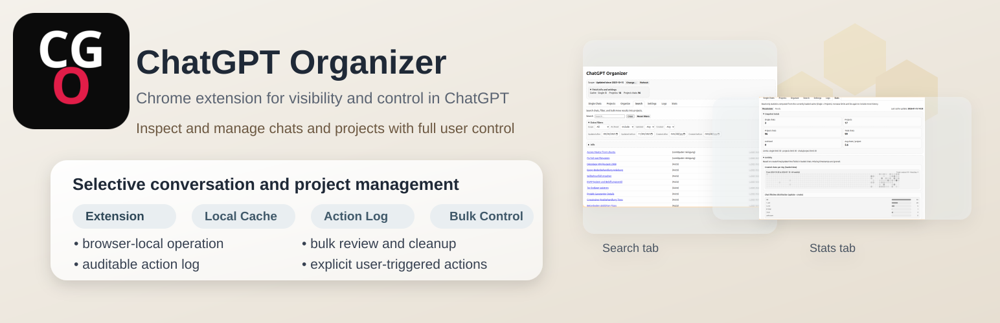
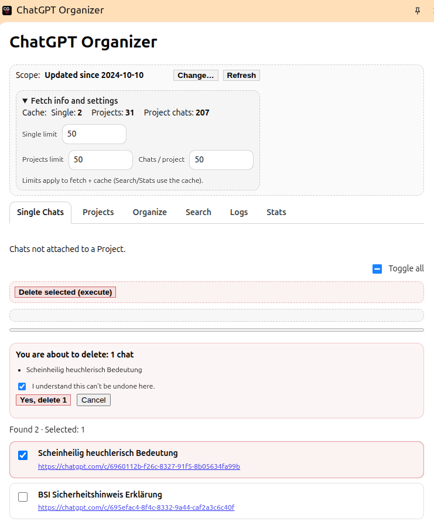
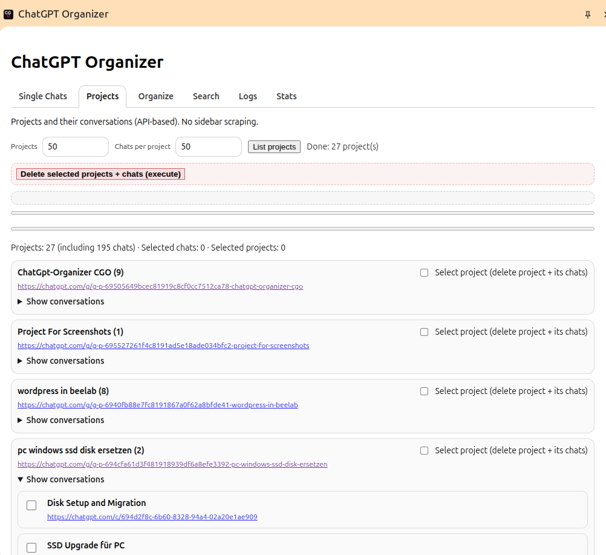
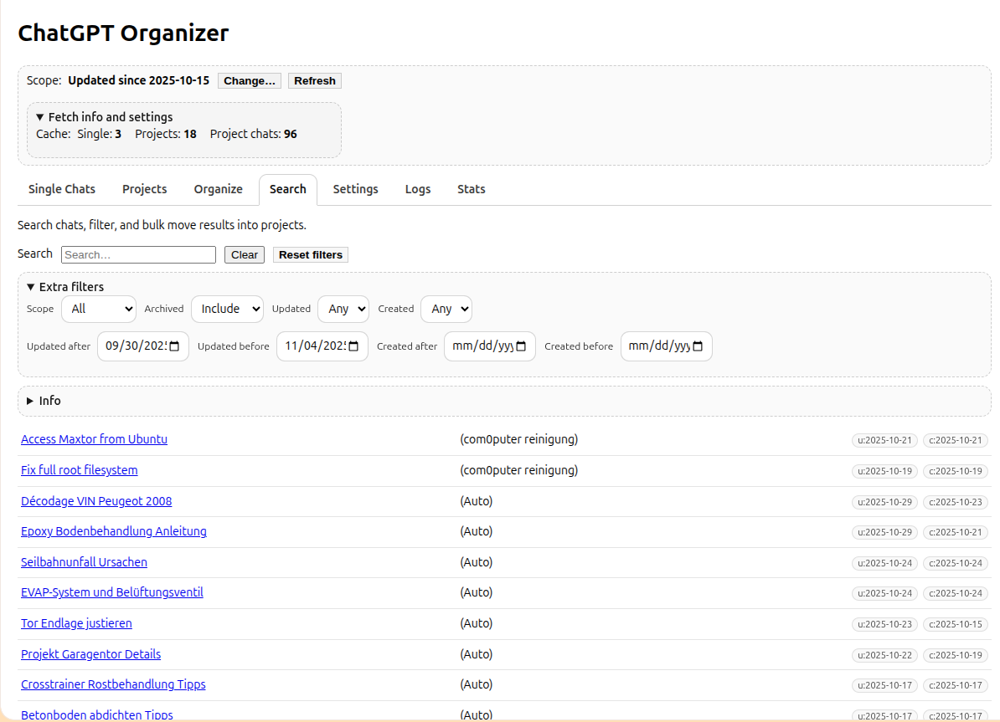
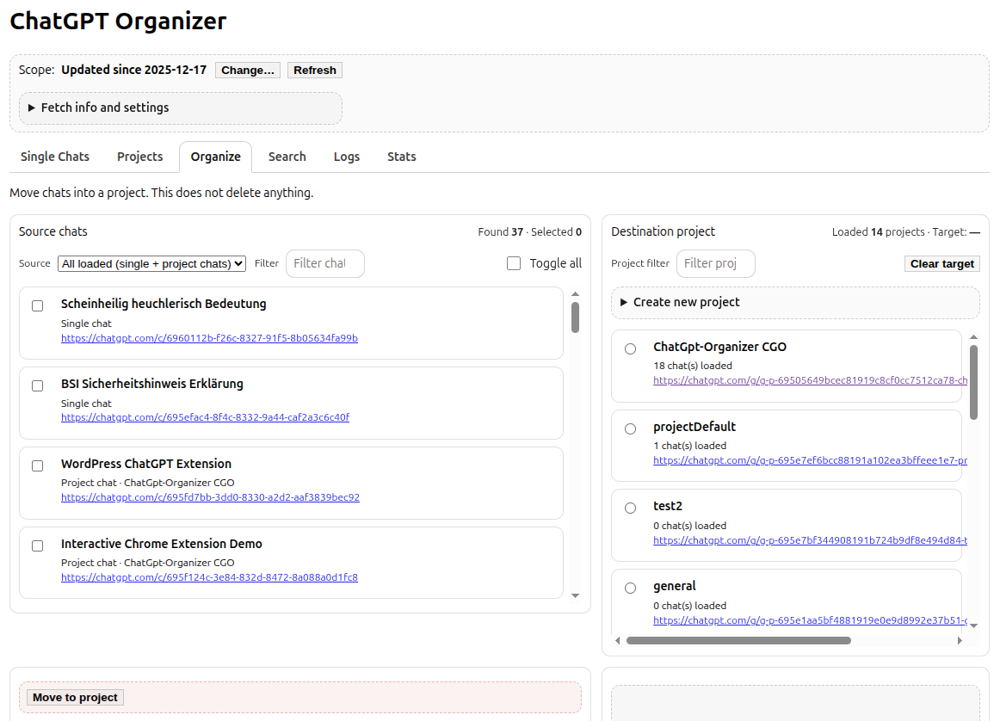
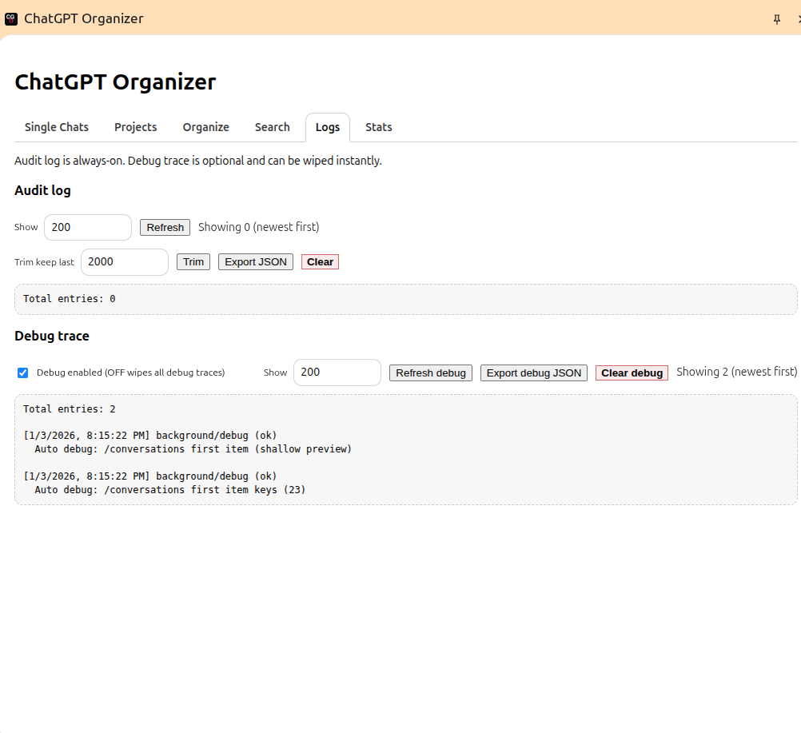
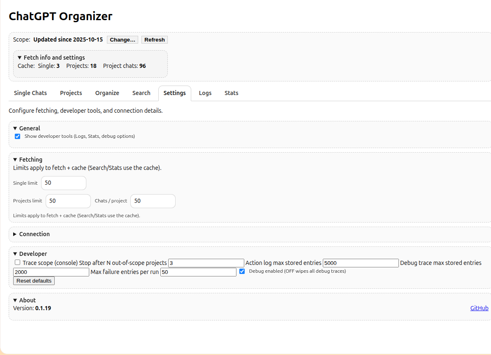
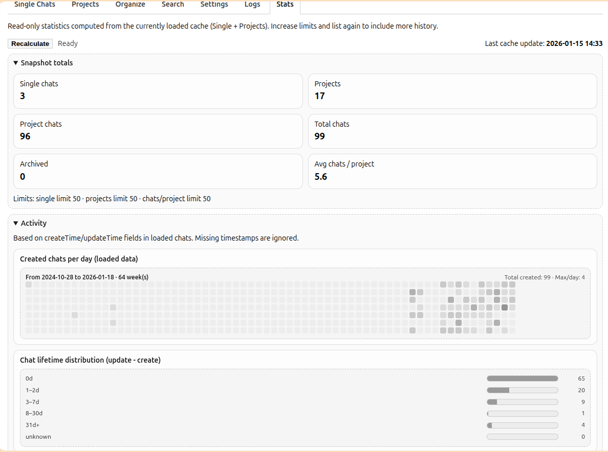
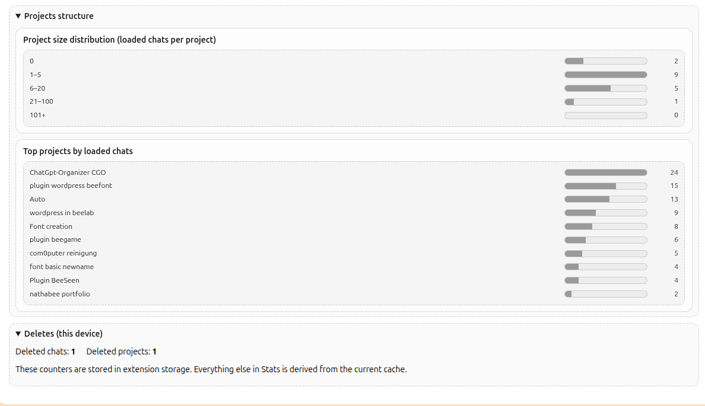

 

  

 
**ChatGPT Organizer** is a Chrome extension designed to give users better **visibility and control** over their ChatGPT conversations and projects.

It focuses on **inspection, organization, and explicit user-triggered actions** — not automation.
Most operations run locally in the browser and rely on your existing ChatGPT session.

---

## Motivation

ChatGPT currently allows users to:

* delete conversations **one by one**, or
* delete **everything at once**.

As conversation histories grow, this becomes impractical:

* older conversations and projects are hard to reach,
* visibility degrades beyond a small number of items,
* meaningful cleanup requires excessive manual work.

What is missing is **selective, bulk control**:

* mass-delete a chosen set of conversations or projects,
* review selections before execution,
* follow progress during long-running operations,
* keep an auditable record of what was changed.

 
ChatGPT Organizer exists to fill that gap.

---

## What it does / does not do

| What it **does**                                | What it **does not do** |
| ----------------------------------------------- | ----------------------- |
| Runs entirely in your browser                   | No credential storage   |
| Uses your existing ChatGPT session              | No background fetching  |
| Retrieves chats and projects **only on demand** | No remote sync          |
| Stores data locally (cache + stats)             | No automatic actions    |
| Provides an auditable action log                | No hidden tracking      |
| Requires explicit confirmation for actions      | —                       |

---

## UI at a glance

| Single                                           | Projects                                          |
| ------------------------------------------------ | ------------------------------------------------- |
|  |  |

| Search                                          | Organize                                            |
| ----------------------------------------------- | ------------------------------------------------ |
|  |  |

| Logs                                          | Settings                                            |
| ----------------------------------------------- | ------------------------------------------------ |
|  |  |

| Stats                                          | Stats                                            |
| ----------------------------------------------- | ------------------------------------------------ |
|  |  |
The interface is organized into **explicit tabs**, each with a single responsibility.

---

## Try it without installing

A **live demo** is available (no account, no extension APIs):

👉 https://nathabee.github.io/chatgpt-organizer/index.html

The demo runs the real panel UI using static data.

---

## Install (from GitHub Release)

1. Go to **GitHub Releases**
2. Download the latest **extension ZIP**
3. Extract it
4. Open Chrome → `chrome://extensions`
5. Enable **Developer mode**
6. Click **Load unpacked**
7. Select the extracted folder containing `manifest.json`

Open ChatGPT → open the side panel → **ChatGPT Organizer**

---

## Documentation

All documentation and the demo are available on the GitHub Pages site:

👉 

- 📘 User Manual  
- 🧩 Architecture & Design  
- 🧪 Publishing Checklist  

---

## Status

**Active development**

- Core architecture is stable
- Tabs: Single, Projects, Organize, Search, Settings, tats, Logs

---

## License

MIT — see `LICENSE`

 