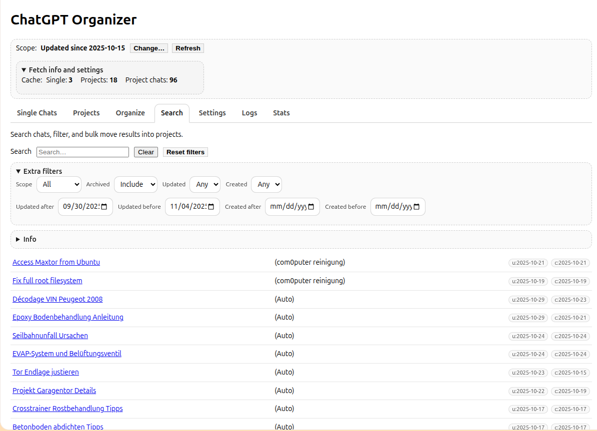
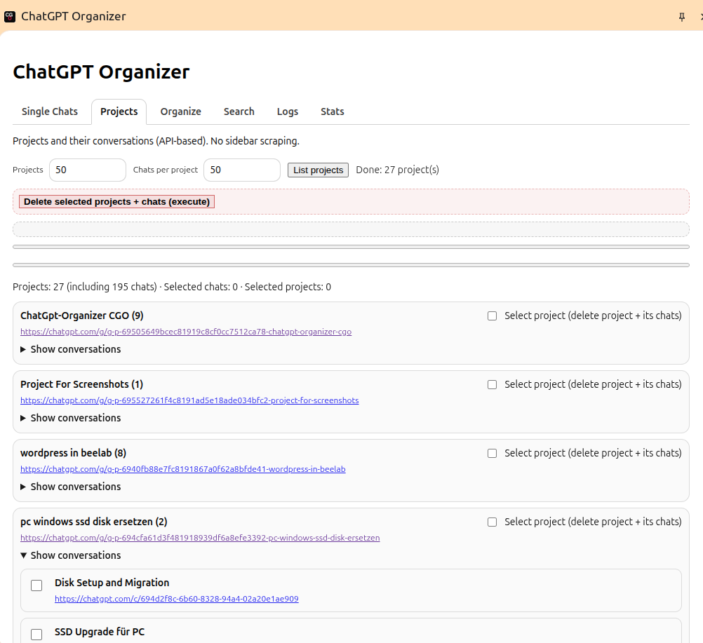
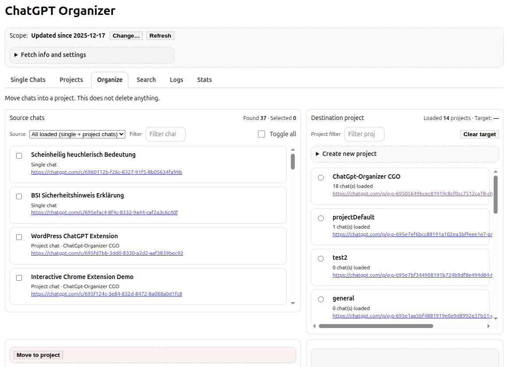
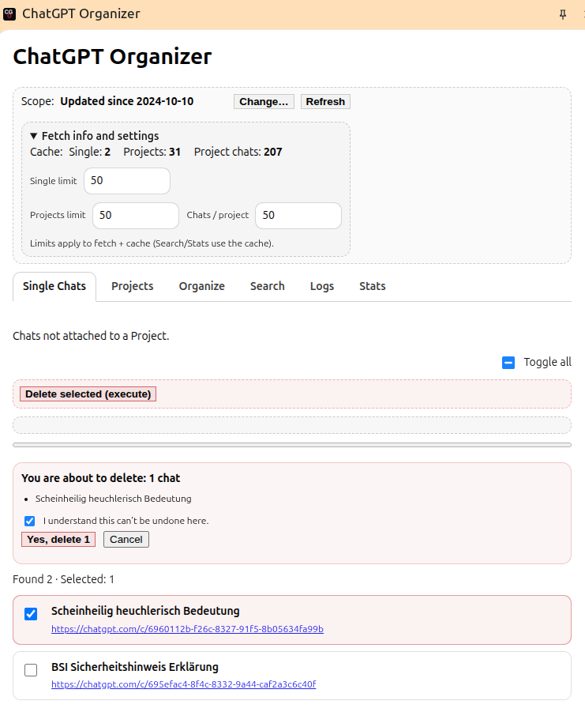
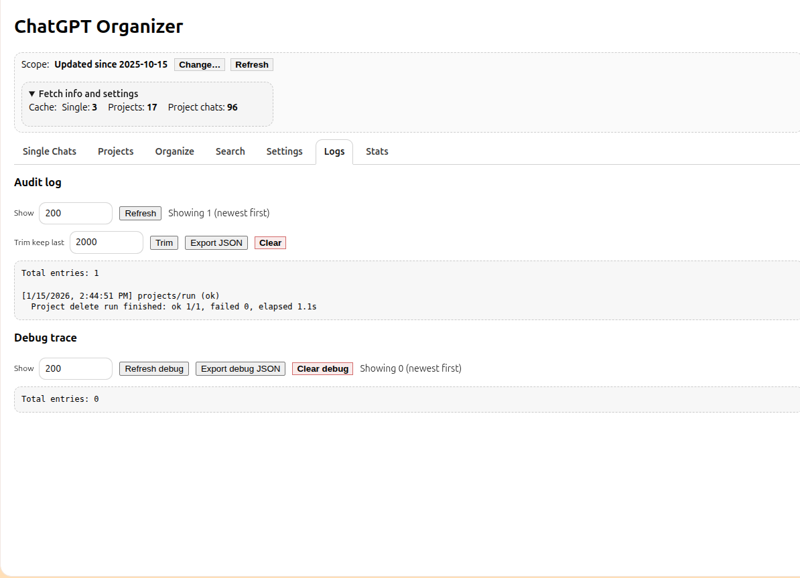
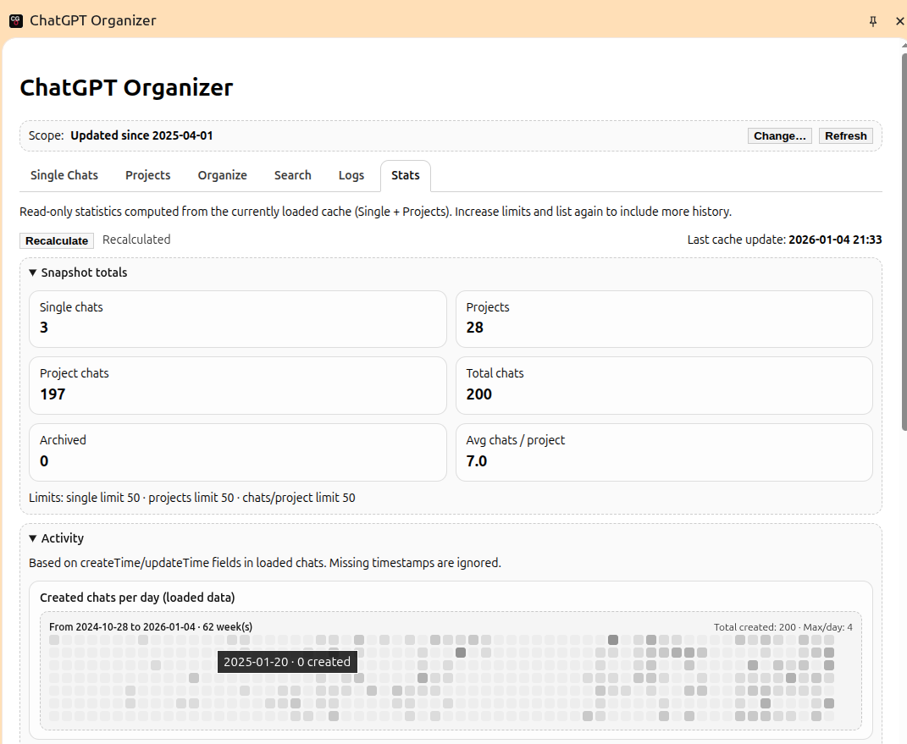

# ChatGPT Organizer — Project Overview

**ChatGPT Organizer** is a browser extension designed to help users inspect and clean up their ChatGPT conversation history.

The project focuses on a practical problem: long conversation histories become hard to manage and can noticeably slow down the ChatGPT web interface.

---

## Motivation

ChatGPT currently allows users to:
- delete conversations one by one, or
- delete all conversations at once

What is missing is controlled, selective cleanup:
- bulk-delete a chosen set of conversations
- review selections before deletion
- see progress and results during long runs

ChatGPT Organizer exists to fill that gap.

---

## What the extension does

### Current capabilities

- Runs as a client-side browser extension
- Adds a Side Panel UI to `chatgpt.com`
- Lists conversations from the active ChatGPT session (scraped from the page UI)
- Supports “deep scan” by auto-scrolling the UI to collect more items
- Checkbox-based selection with live counters
- Safe bulk deletion with:
  - explicit confirmation (count + preview + checkbox)
  - throttling and retry/backoff behavior
  - progress feedback and per-item logging

Notes:
- The extension only sees conversations that the ChatGPT web UI loads. Very large histories may require additional scanning strategies.

### Planned capabilities

- Better handling for very large histories:
  - improved deep scan strategies
  - optional chunked deletion (batch runs)
- Keyword filtering (titles)
- Local-only grouping (for example: “projects”)
- Basic statistics based on local scanning history (first seen / last seen)

---

## Design principles

- Local-first: runs entirely in the browser
- No tracking: no analytics, no telemetry
- Transparent: readable, auditable source code
- Incremental safety: destructive actions are introduced carefully
- Minimal dependencies: no framework, no server

---

## Technical overview

- Browser extension (Chrome / Chromium, Manifest V3)
- TypeScript
- esbuild
- Side Panel UI (Chrome API)
- Content scripts operating in the user’s logged-in ChatGPT session
- Background service worker handles authenticated delete requests using the existing session

---

## Security and privacy

- The extension does not ask for ChatGPT credentials
- It does not send data anywhere
- It operates only on `chatgpt.com`
- All actions are performed within the browser context of the logged-in user

---
## UI Overview

The extension lives entirely in the **ChatGPT side panel**.
Each tab has a single, explicit responsibility.

### Search tab

### Projects tab

### Organize tab**

### Single tab**

### Logs tab

### Stats tab

The side panel is organized into **explicit tabs**, each with a single responsibility.

---

## Project status

The extension is functional and under active development.  
APIs and UI may change as ChatGPT’s web interface evolves.

---

## Roadmap (high-level)

1. Stable scanning (quick scan + deep scan)
2. Safer bulk deletion (progress, retries, clear reporting)
3. Better large-history workflows (chunking, improved scan strategies)
4. Optional enhancements (filtering, grouping)

---

## License

MIT — see `LICENSE` 